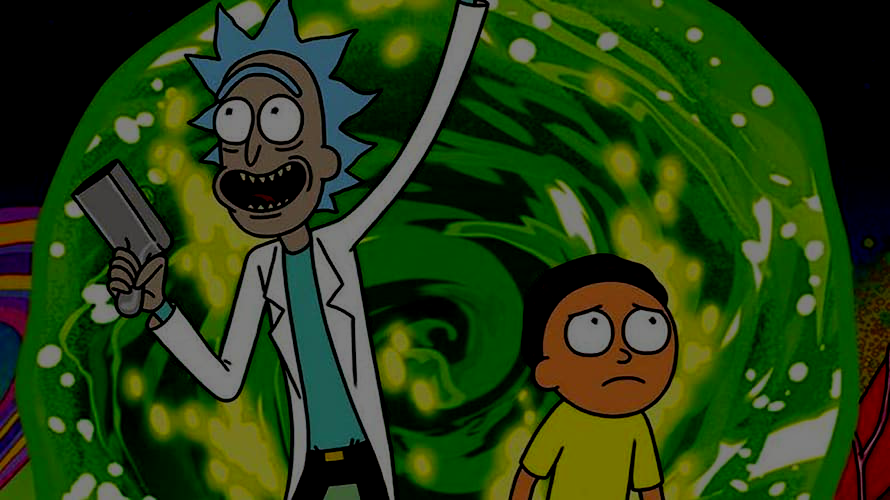

# PicEditPy
## Introduction

Basic graphic editor with CLI. Editor supports basic image manipulation on RGB
and BW images specified by CLI arguments.

## Getting Started

Editing the image in CLI follows this format:
```
python graphic_editor.py --[OPERATION] --[NEXT_OPERATION]... [INPUT_FILE] [OUTPUT_FILE]
```
where INPUT_FILE and OUTPUT_FILE are required arguments.
To get more info, simply type  ```python graphic_editor.py --help ```.

Run with python version 3.6.9 or higher.

#### Image operations
- ```rotate``` - Rotate an image 90 degrees to the right
- ```mirror``` - Mirrored image
- ```inverse``` - Inverse image
- ```bw``` - Transform to black and white
- ```lighten <percentage: 0-100>``` - Make image some percentage lighter
- ```darken <percentage: 0-100>``` - Make image some percentage darker
- ```sharpen``` - Apply sharpening kernel on the image (convolution)
- ```blur``` - Applying Gaussian blur 3x3 kernel on the image (convolution)

### Dependencies

- numpy
- pillow
- pytest

## Running the tests

Pytest is used for testing. Tests cover all of the supported image operations. Result
of each operation is compared with reference image.

To run the tests, simply type ```pytest``` inside the projects directory.

## Examples

Original image


-lighten 50


-darken 50



-sharpen


## Authors

* **Ladislav Floriš**

## Acknowledgments

* Inspiration and description of various image operations using python: https://note.nkmk.me/en/